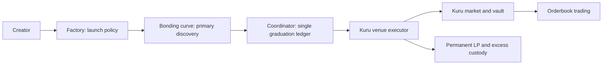

# RetroPick — Monad Metropolis

## One sentence

The market creation layer for Monad: launch through onchain price discovery, then graduate into protected Kuru orderbook liquidity.

## Problem

Issuing a token does not create a mature market. Creators need discovery, initial liquidity and a credible transition to secondary execution.

## Solution

RetroPick connects token issuance, bonding, a single graduation ledger, verified venue execution and permanent custody of graduation LP/excess assets.

## Why Monad

Frequent primary trading and many secondary orderbooks benefit from low-cost execution, fast settlement and responsive market state. This is asset and market infrastructure built for a high-performance EVM.

## Why Kuru

RetroPick originates markets. Kuru provides mature secondary execution, limit orders and market-making workflows. The demo creates an actual market/vault and completes actual order/fill/cancel transactions. Execution quality still depends on market depth and spreads.

## Live Demo

Canonical Monad Testnet lifecycle: **MON launch PASS; Kuru graduation PASS; two-actor order/fill/cancel PASS**. Public frontend and videos are undergoing release verification. [Six canonical proof transactions](docs/hackathon/EVIDENCE_MAP.md); full 43-transaction manifest remains available.

## Deployed Contracts

| Role | Address |
| --- | --- |
| Factory | `0xa7f18b9eceb0A9852b08408854A45D00fc682454` |
| Coordinator | `0xaD62309242EA65BB07C833669EC6a4ED23AF738F` |
| Token | `0x43e7e9b1b7d9A143573307b13D14B51580c18f15` |
| Curve | `0x454A3A449d4e65CA5203d331905d167BA218E276` |
| Kuru market | `0x1F5dE72616a7fe645Cf45aC66dfce8Ac7452C57F` |
| Kuru vault | `0xc88DED06eB0081430Ff02d124C22b532e122CbE7` |
| LP/excess lock | `0x72ced84b20Bb8467c5547e3EbF85E62321B6a425` |

Explorer links and source/transaction mapping: [Evidence Map](docs/hackathon/EVIDENCE_MAP.md).

## Architecture

## Technical Differentiation

Two-stage discovery/execution; extracted graduation authority; Factory runtime **23,423 bytes** from approximately 24,565; exact integer completion liveness; protected graduation assets. Venue choice is immutable; atomic completion can be retried permissionlessly.

## Metropolis Track Fit

**Onchain Finance & Trading**: issuance, price discovery, liquidity formation and orderbook execution on Monad. [Verified requirements and judging](docs/hackathon/METROPOLIS_REQUIREMENTS.md).

## Kuru Bounty Fit

Primary: **Bring New Assets and Markets to Kuru**. We provide creator/community issuance and market-origination infrastructure. Asset-class novelty and verified demand remain qualification risks. Secondary consumer-app fit depends on verified live UI and acquisition/retention evidence. [Requirement-by-requirement map](docs/hackathon/KURU_BOUNTY.md).

## Verification

Historical candidate: **145 pass / 0 fail / 0 skip**, fork **69,507,986**. Deployed source `f0363249f4b74e58dde37d1241742ca5a92bcfe3`; main integration baseline `84861f50494a79772cf6f97a5e710bcc24973d5e`. Current release SHA/checks are separate. [Manifest](deployments/monad-testnet/v2.json) and [release evidence](evidence/launchpad/v2-monad-testnet/README.md).

## Roadmap

30 days: testnet hardening, reliable frontend/feed, creator discovery. 60 days: external security review, qualified assets, SDK/API and pilots. 90 days: reviewed mainnet candidate contingent on security and operational gates, plus measured ecosystem campaigns. [Detailed plan](docs/hackathon/MONAD_PARTNERSHIP.md).

## Limitations

Unaudited testnet candidate, no mainnet/production claim. Circle-USDC live smoke **BLOCKED_FUNDING**. Protected custody does not guarantee token safety or deep liquidity. Founder reports early audience interest; analytics and commercial commitments remain unverified. Tests are not an audit.

## Team / Contact

[RetroPick X](https://x.com/RetroPickMarket) · [GitHub](https://github.com/RetroPick/retropick-protocol). Founder/team names and submission contact must be completed accurately in the portal; no identity is invented here.

## Partnership Vision

RetroPick supplies market origination and creator distribution; Monad settles both phases; Kuru supplies secondary infrastructure. We seek mentorship, qualified ecosystem/Kuru introductions, infrastructure and security support. We intend to earn a canonical role through market quality and retained traders, not claim an official partnership. [Partnership memo](docs/hackathon/MONAD_PARTNERSHIP.md).
