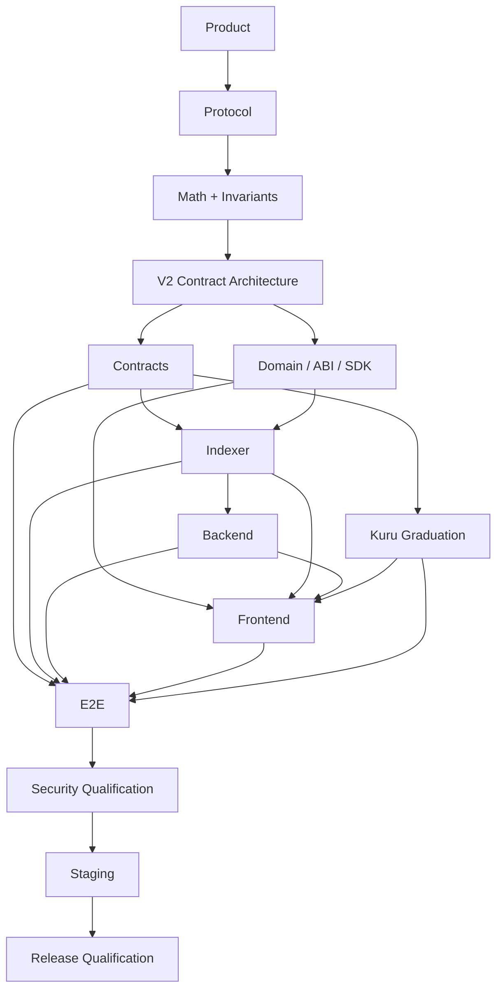

# Dependency DAG

```mermaid
flowchart TD
  P[Product] --> R[Protocol]
  R --> M[Math + Invariants]
  M --> A[V2 Contract Architecture]
  A --> C[Contracts]
  A --> D[Domain / ABI / SDK]
  C --> K[Kuru Graduation]
  C --> I[Indexer]
  D --> I
  D --> W[Frontend]
  I --> B[Backend]
  I --> W
  B --> W
  K --> W
  C --> E[E2E]
  I --> E
  B --> E
  W --> E
  K --> E
  E --> S[Security Qualification]
  S --> ST[Staging]
  ST --> REL[Release Qualification]
```

Every edge is represented in `control/handoffs.yaml`.
