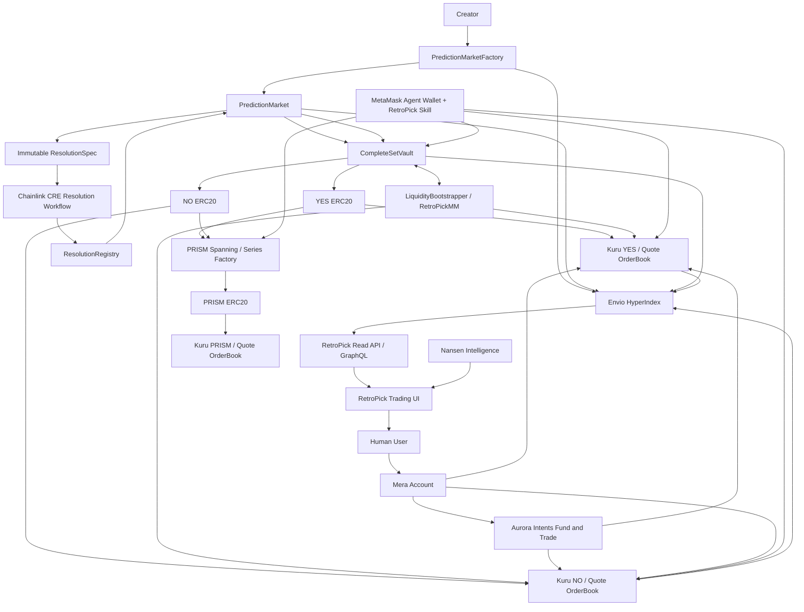
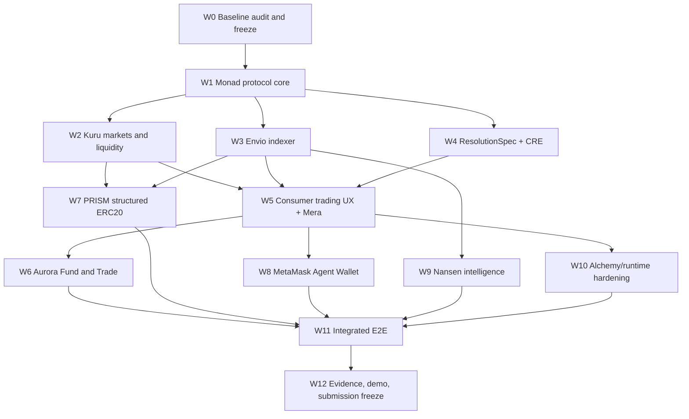

# RetroPick Metropolis 2026
## Canonical Agent Development Workflow, Sponsor Integration Architecture, and Execution Goal

**Status:** Canonical implementation plan for Monad Metropolis 2026  
**Research snapshot:** 2026-09-17  
**Primary track:** Onchain Finance & Trading  
**Product:** RetroPick Prediction Market Launchpad + PRISM Structured Markets  
**Target chain:** Monad  
**Portal deadline captured for the Kuru bounty:** 2026-10-14 10:59 GMT+7  
**Internal code freeze:** 2026-10-11 23:59 GMT+7  
**Internal submission freeze:** 2026-10-12 23:59 GMT+7

> Public Metropolis announcements describe submissions as closing October 13, while the captured Kuru bounty portal view shows October 14, 2026 at 10:59 GMT+7. Agents must not resolve this discrepancy by assumption. Treat the live submission portal as authoritative, and use the earlier internal freeze above.

---

# 0. Purpose of this document

This document is the single source of truth for agents implementing RetroPick for the Monad Metropolis hackathon.

It is not a sponsor-integration checklist. It defines one coherent product and assigns every sponsor technology a bounded responsibility inside that product.

The target product is:

> **RetroPick is a permissionless prediction-market launchpad on Monad. A creator turns an event into fully collateralized ERC-20 outcome assets, those assets trade through Kuru's onchain order book, and PRISM can optionally compose outcome assets into fully backed structured ERC-20 products.**

The core product equation is:

```text
Event
  ↓
RetroPick market definition + collateralization + resolution
  ↓
YES ERC20 / NO ERC20
  ↓
Kuru spot order books
  ↓
Prediction-market trading
```

PRISM extends that equation:

```text
RetroPick outcome ERC20s
  ↓
PRISM payoff composition + backing verification
  ↓
Structured ERC20 series
  ↓
Kuru spot order book
```

The engineering rule for every agent is:

> **Sponsor integrations must strengthen this architecture. Do not distort the product to collect bounty logos.**

---

# 1. Metropolis objective

## 1.1 Main goal

Ship a deployed, demoable Monad application proving that a generic ERC-20 spot CLOB can become prediction-market infrastructure when RetroPick supplies the missing financial semantics:

- event definition;
- immutable resolution specification;
- full collateralization;
- complete-set issuance;
- complete-set merging;
- ERC-20 outcome issuance;
- creator-controlled but protocol-constrained market deployment;
- resolution and redemption;
- prediction-specific liquidity formation;
- prediction-aware arbitrage;
- structured derivative composition through PRISM.

The application must be a functional product, not a set of isolated sponsor demos.

## 1.2 Hackathon thesis

**Kuru provides market microstructure. RetroPick provides prediction-market semantics.**

Kuru should not mint RetroPick financial claims. RetroPick mints them under its collateral and resolution invariants, then uses Kuru Router to create markets for the already-existing claim tokens.

This distinction is fundamental:

```text
RetroPick
  owns:
  issuance
  collateralization
  payoff semantics
  resolution
  redemption
  structured composition

Kuru
  owns:
  CLOB
  limit orders
  market orders
  matching
  market liquidity
  trading execution
```

## 1.3 Primary success condition

A new user must be able to complete the following end-to-end demo:

```text
1. Create/recover a Mera passkey account.
2. Fund that account from another supported chain through Aurora Intents.
3. Browse a RetroPick prediction market powered by Envio-indexed state.
4. Buy a YES or NO outcome through a real Kuru order book.
5. Observe indexed position/trade updates.
6. Show complete-set split/merge parity and collateral backing.
7. Resolve a market through a CRE workflow using a pinned ResolutionSpec.
8. Redeem the winning outcome token.
9. Create or inspect a PRISM structured ERC20 built from RetroPick outcomes.
10. Demonstrate the MetaMask Agent Wallet integration executing a RetroPick-specific action.
```

A submission is not complete if only the UI works while underlying sponsor transactions are mocked.

---

# 2. Research provenance and source-of-truth policy

## 2.1 Metropolis bounty data

The bounty inventory, prize amounts, tracks, and the detailed Kuru `Bring New Assets and Markets to Kuru` text were captured from the Metropolis portal by the product owner on 2026-09-17.

Some Metropolis detail pages are client-rendered and were not fully retrievable through standard web indexing during research. Therefore this document uses:

1. the captured Metropolis portal text for bounty wording and portal deadline;
2. public Monad/partner announcements for hackathon-level corroboration;
3. current sponsor documentation as authoritative for technical capability.

Agents must re-check the live bounty page before final submission and update `docs/metropolis/BOUNTY_SNAPSHOT.md` if criteria change.

## 2.2 Official technical sources

The following sources were checked while preparing this plan:

- Monad Developer Portal: https://developers.monad.xyz/
- Monad documentation: https://docs.monad.xyz/
- Kuru current docs: https://docs.kuru.io/
- Kuru deploy-market docs: https://docs.kuru.io/sdk/deploy-market
- Kuru Router: https://docs.kuru.io/contracts/Router
- Kuru OrderBook: https://docs.kuru.io/contracts/OrderBook
- Kuru liquidity: https://docs.kuru.io/concepts/liquidity
- Kuru bounty-provided testnet docs: https://kuru-testnet-docs.mintlify.site/
- Kuru bounty-provided faucet gist: https://gist.github.com/devblixt/80740a416ddc6afd2618c365b1f6cf98
- Envio: https://docs.envio.dev/
- Envio HyperIndex: https://docs.envio.dev/docs/HyperIndex/overview
- Aurora Intents: https://intents.aurora.dev/
- NEAR Intents: https://docs.near-intents.org/
- NEAR Intents supported chains: https://docs.near-intents.org/resources/chain-support
- Mera: https://github.com/category-labs/mera
- Chainlink CRE changelog / Monad support: https://dev.chain.link/changelog/cre-cli-v1-29-0--monad-mainnet-support-and-confidential-workflows
- MetaMask Agent Wallet: https://docs.metamask.io/agent-wallet/
- MetaMask Agent Wallet supported chains: https://docs.metamask.io/agent-wallet/reference/supported-chains/
- Nansen API: https://nansen.ai/api
- Nansen API getting started: https://release.nansen.ai/en/help/articles/0938495-get-started-with-api
- Alchemy Monad: https://www.alchemy.com/rpc/monad

## 2.3 Capability facts agents may rely on

As of the research snapshot:

- Kuru Router can deploy a market for an existing pair and `NO_NATIVE` means both base and quote are ERC-20 tokens.
- Kuru Router deployment also creates an associated Kuru AMM vault.
- Kuru's OrderBook is a central limit order book with price-time priority and integrated AMM liquidity.
- Kuru supports limit buy/sell orders, market buy/sell, FOK market execution, L2 book reads, paired liquidity and batch liquidity provisioning.
- Kuru liquidity can come from vaults, concentrated/flip-order liquidity, a backstop AMM, and external market makers on the CLOB.
- Kuru Router deployment alone does not create usable market depth; liquidity must be seeded or quoted.
- Envio HyperIndex converts onchain events into structured databases and GraphQL APIs, supports real-time indexing, reorg handling and factory-created contracts.
- Aurora Intents advertises cross-chain swaps, chain-specific deposits, and custom multi-step cross-chain execution. It is powered by NEAR Intents.
- NEAR Intents currently lists Monad as a supported EVM network.
- Mera derives account material from passkeys, does not require a custody backend, and can also secure other data with a passkey.
- Chainlink CRE CLI v1.29.0 added Monad mainnet production onchain writes and simulation support.
- MetaMask Agent Wallet currently lists Monad mainnet chain ID 143 and Monad testnet chain ID 10143. It exposes raw EVM signing/transactions and prediction-market capabilities under mandatory safety controls.
- Nansen exposes programmatic Smart Money, holder, flow, DEX-trade and wallet intelligence APIs. Monad has Nansen onchain coverage.
- Alchemy exposes Monad RPC and WebSocket endpoints.

No agent may convert these statements into broader claims than the cited product actually guarantees.

---

# 3. Sponsor portfolio

## 3.1 Core bounty targets

| Bounty | Prize | Track | RetroPick role | Priority |
|---|---:|---|---|---|
| Kuru: Bring New Assets and Markets to Kuru | $5,000 | Onchain Finance & Trading | Outcome-token markets + PRISM structured assets | P0 |
| Kuru: Build the Next Consumer Trading App | $5,000 | Onchain Finance & Trading | Prediction-native trading terminal over Kuru | P0 |
| Envio: Best Use of Envio | $1,000 | All tracks | Canonical indexed market/trading state | P0 |
| Aurora Intents: Bring Any-Chain Liquidity to Monad | $5,000 | All tracks | Fund-and-trade from external chains | P0 |
| Monad Foundation: Best Mera-Powered UX | $2,500 | All tracks | Entire normal-user account layer | P0 |
| Chainlink: Best Workflow with CRE | $3,000 | All tracks | Market resolution orchestration | P0 |
| MetaMask: Best Agent Wallet Plugin | $2,500 | Onchain Finance & Trading | RetroPick-specific autonomous trading skill/plugin | P1 |
| Monad Foundation: Mera One Passkey, Many Keys | $2,500 | All tracks | Passkey-protected private strategy data | P1 |
| Nansen: Best Use of Nansen | $5,000 total pool | All tracks | Market discovery/risk intelligence | P1 |
| Alchemy: Best Projects using Alchemy | $1,000 credits | All tracks | RPC/WebSocket transport | P2 |
| Monad Foundation: Best Community Team Project | $5,000 | All tracks | Conditional on valid community-supporter eligibility | Conditional |

The cash bounty pool represented by P0/P1 targets is approximately $31.5K before the conditional community bounty, assuming the stated bounty amounts and ignoring whether pools are split among multiple winners. This is a target surface, not an expected award value.

## 3.2 Explicitly deferred or skipped

Do not add these unless the core product is complete and the track rules permit it:

- Agora Cross-Border Payments: different product and track.
- Agora Mobile Trading: explicitly requires Mera + AUSD + Perpl trading, which would create a second trading product.
- Perpl API / Perpl Risk: meaningful only if building a Perpl-focused bot or risk system.
- Dynamic: duplicates normal account onboarding if Mera is the entire account layer.
- Privy: can be useful for service wallets but weakens the Mera account story and requires a substantive beyond-login integration.
- Cleanverse: assigned to Trust, Identity & AI Infrastructure in the captured bounty list.
- Qwen: assigned to Trust, Identity & AI Infrastructure in the captured bounty list.
- Hunyuan: assigned to Social, Attention & Culture.
- Kimi: All tracks but credits-only and non-core. Add only after product acceptance gates pass.

---

# 4. Detailed bounty contract: Kuru, Bring New Assets and Markets

## 4.1 Captured bounty requirement

**Bounty:** Bring New Assets and Markets to Kuru  
**Prize:** $5,000 USD, single prize  
**Track:** Onchain Finance & Trading  
**Captured deadline:** Oct 14, 2026 at 10:59 GMT+7

Captured purpose:

> Build a new class of tradable markets on Kuru using its spot order book. Kuru is looking for founders creating assets or market categories not yet available onchain, together with the infrastructure required to make them viable, including issuance, settlement, liquidity, compliance and user onboarding.

Captured judging criteria:

- solve more than the trading interface;
- clearly define the asset class and customer;
- show evidence of demand;
- present credible issuance/redemption mechanics;
- address legal and operational viability;
- present a liquidity strategy.

Captured deliverables:

- clear asset class and target customer;
- evidence users want to trade or own it;
- credible issuance, redemption or settlement;
- legal/operational onchain plan;
- initial-market and liquidity strategy;
- post-hackathon continuation plan.

Captured suggested starting points explicitly include **event or outcome contracts (prediction markets)**.

## 4.2 RetroPick answer to this bounty

RetroPick brings two new ERC-20 asset classes to Kuru:

### Atomic event assets

```text
BTC150-YES-DEC26
BTC150-NO-DEC26
FEDCUT-YES-DEC26
FEDCUT-NO-DEC26
```

Each token is a fully collateralized bearer claim with deterministic resolution rules.

### Structured event assets

```text
pFEDBTC-DEC26
pAI-MACRO-Q1-27
pRATEOIL-DEC26
```

Each PRISM token is fully backed by an immutable basket of underlying RetroPick outcome assets.

## 4.3 Issuance/redemption mechanism

For a binary market with quote/collateral asset `USDC`:

```math
1\ USDC \rightarrow 1\ YES + 1\ NO
```

Before final resolution:

```math
1\ YES + 1\ NO \rightarrow 1\ USDC
```

After final resolution:

```text
winner -> 1 USDC
loser  -> 0
```

For quantity `q`:

```math
lockedCollateral = q
```

must hold before minting `q YES + q NO`.

No owner, admin or market creator may mint an individual outcome token without complete-set collateralization.

## 4.4 Kuru market formation

RetroPick must use Kuru Router for existing tokens, not Kuru Deployer.

For each market:

```text
YES ERC20 / USDC ERC20 -> Kuru NO_NATIVE market
NO  ERC20 / USDC ERC20 -> Kuru NO_NATIVE market
```

Kuru's current Router documents `NO_NATIVE` as a market where base and quote are both ERC-20s.

Market deployment is not sufficient. The launch transaction must also establish a credible liquidity path.

### Minimum viable liquidity strategy

Maintain strict separation between:

```text
Backing collateral
!=
Trading liquidity capital
```

Backing collateral exists to honor claims. It may never be treated as LP capital or protocol revenue.

A creator can optionally fund a `LiquidityBootstrapBudget` that is used to:

1. split fully collateralized complete sets to obtain initial YES and NO inventory;
2. provide separate quote-token inventory;
3. seed the two Kuru vaults or quote the two CLOBs;
4. start a prediction-specific market maker.

The liquidity agent must monitor complete-set parity:

```math
Ask_{YES} + Ask_{NO} < 1 - costs
```

implies buy both and merge for collateral.

```math
Bid_{YES} + Bid_{NO} > 1 + costs
```

implies split collateral and sell both outcomes.

This mechanism anchors complementary outcome prices around their collateral identity without claiming that liquidity appears automatically.

## 4.5 Demand evidence requirement

Agents may not fabricate demand.

The submission evidence folder must contain at least three categories from:

- real testnet/mainnet trader sessions;
- user interviews;
- waitlist signups;
- creator interviews;
- market creation funnel analytics;
- repeat trading sessions;
- user feedback screenshots or transcripts with consent;
- actual test-market order/volume metrics.

Produce `evidence/demand/DemandEvidence.md` with methodology and raw-source references.

## 4.6 Legal and operational plan

For the hackathon, implement a **curated-launch mode** even if permissionless creation is the long-term target.

Market creation must require:

- a machine-readable ResolutionSpec;
- prohibited-category screening;
- explicit creator disclosure;
- immutable timing and invalid/cancelled-event handling;
- one approved collateral token;
- bounded duration;
- supported resolver/source adapter;
- creator acknowledgement that deployment does not imply regulatory approval.

Do not claim general legal compliance. Public permissionless production launch requires jurisdiction-specific legal review.

---

# 5. Detailed bounty contract: Kuru Consumer Trading App

The captured bounty asks for a focused spot trading product that routes trades through Kuru's onchain order book.

RetroPick must make Kuru the actual execution venue, not a link-out.

## Required product surface

A market page must include:

```text
Question
Resolution source
Resolution time
YES price / bid / ask
NO price / bid / ask
Normalized market-implied probability
Order book depth
24h volume
Open interest / outstanding complete sets
Liquidity
User position
Resolution status
```

Trading must support at minimum:

- market buy;
- market sell;
- limit buy;
- limit sell;
- quote/slippage preview;
- transaction state;
- cancellation for resting orders where supported.

Kuru's current OrderBook supports limit orders, market orders, FOK market execution, best bid/ask and L2 depth reads.

## Probability presentation

Do not blindly label a single spot price as probability when complementary books are dislocated.

Given mid prices `mY` and `mN`, a normalized display can be:

```math
p_Y = \frac{m_Y}{m_Y + m_N}
```

but execution surfaces must still show real bid/ask prices and not hide parity deviations.

---

# 6. Envio integration

## 6.1 Bounty intent

The captured bounty requires meaningful use of HyperIndex, HyperSync or HyperRPC to power real onchain data driving a core feature.

RetroPick should use Envio as the canonical **read-model and market intelligence projection layer** for Monad product state.

Envio must not be a decorative transaction-history page.

## 6.2 Event graph

Index at least:

```text
PredictionMarketFactory.MarketCreated
PredictionMarket.OutcomeTokensCreated
CompleteSetVault.Split
CompleteSetVault.Merged
KuruAdapter.MarketRegistered
PredictionMarket.MarketLocked
ResolutionRegistry.ResolutionRequested
ResolutionRegistry.MarketResolved
CompleteSetVault.Redeemed

PrismSeriesFactory.SeriesCreated
PrismVault.BackingDeposited
PrismSeries.Minted
PrismSeries.Redeemed
```

Kuru order-book trade events must also be indexed or joined into the read model.

## 6.3 Derived Envio entities

```text
Market
OutcomeToken
KuruMarket
Trade
OrderbookSnapshotReference
LiquiditySnapshot
CompleteSetActivity
Resolution
UserPosition
MarketCreator
CreatorStats
PrismSeries
PrismBacking
PrismActivity
```

Derived metrics:

```text
normalized implied probability
bid/ask spread
YES + NO parity deviation
volume
unique traders
outstanding supply
collateral locked
creation/redemption activity
creator history
resolution latency
PRISM supply/backing
```

## 6.4 Agent acceptance gate

Envio integration passes only when:

1. a working indexer exists in the repo;
2. deployment configuration names the deployed Monad contracts;
3. dynamic/factory-created markets are indexed;
4. GraphQL queries are consumed by the real frontend/backend;
5. a chain reorg or replay test is documented;
6. the demo visibly changes based on Envio-indexed state.

Envio HyperIndex supports real-time indexing, reorg handling, GraphQL APIs and factory-created contract indexing, which makes it a strong fit for the launchpad.

---

# 7. Aurora Intents integration

## 7.1 Bounty intent

The captured bounty is `Bring Any-Chain Liquidity to Monad` and asks for Aurora Intents integration for any-chain deposits, swaps, or deposit-and-execute flows.

Aurora Intents currently markets:

- cross-chain swaps;
- chain-specific deposit addresses;
- automatic bridging/conversion;
- custom multi-step flows through Intents Connect;
- non-custodial solver-based execution.

NEAR Intents currently lists Monad as a supported EVM chain.

## 7.2 RetroPick product feature

Do not build a standalone `Bridge` page.

Build:

> **Fund & Trade**

Example:

```text
User owns USDC on Base
        ↓
RetroPick Buy YES $100
        ↓
Pay with Base USDC
        ↓
Aurora Intents
        ↓
Monad supported quote asset
        ↓
Kuru YES/quote execution
        ↓
User receives YES token
```

The route must preserve user-visible max input/min output and failure/refund state.

## 7.3 Acceptance gate

Pass only when an end-to-end supported source-chain-to-Monad route is demonstrated with real Aurora/NEAR Intents infrastructure and the destination funds are actually used by a RetroPick trading flow.

A widget visible in the app without downstream trade consumption does not satisfy RetroPick's own standard.

---

# 8. Mera integrations

## 8.1 Best Mera-Powered UX

Mera must be the default and complete account layer for normal human users.

Target onboarding:

```text
Open RetroPick
  ↓
Create/passkey authenticate
  ↓
Mera-derived self-custodial account
  ↓
Fund
  ↓
Trade
```

Do not show a normal-user wallet matrix containing Mera + Dynamic + Privy + MetaMask. That weakens the architecture and the bounty story.

MetaMask Agent Wallet is a separate autonomous-agent integration surface.

### Acceptance

- create account from passkey;
- sign Monad transaction;
- restore/recover according to Mera-supported recovery semantics;
- no app custody backend for user keys;
- app handles funding flow explicitly;
- error states for unsupported authenticators/devices are tested.

Mera is currently in preview, so pin the exact dependency commit/version used by the submission.

## 8.2 Mera: One Passkey, Many Keys

Build a **Private Strategy Vault** as the creative non-wallet use.

Protected data can include:

```text
private market drafts
unpublished PRISM recipes
watchlists
risk limits
agent policies
market-making configuration
favorite creators
private thesis notes
```

Implementation rule:

- use Mera's documented passkey/data-protection primitives;
- apply explicit domain separation for strategy data;
- never export or reuse wallet private-key material as an ad-hoc encryption key;
- store only ciphertext server-side if cloud sync is implemented.

The PRF/data-protection implementation must have a small threat model covering device compromise, ciphertext theft, replay and account recovery.

---

# 9. Chainlink CRE integration

## 9.1 Bounty intent

The captured bounty asks for a CRE Workflow used as an orchestration layer inside the project.

The strongest native use for the launchpad is resolution orchestration.

## 9.2 `RetroPickResolutionWorkflow`

```text
Market reaches resolution window
        ↓
CRE workflow starts
        ↓
Read immutable ResolutionSpec
        ↓
Call approved evidence/source adapter
        ↓
Validate source identity + timestamp + finality
        ↓
Generate evidence hash
        ↓
Submit bounded result to Monad
        ↓
ResolutionRegistry.finalize(...)
        ↓
Outcome becomes redeemable
```

CRE must orchestrate the workflow. It must not be described as deciding truth by itself.

The source-of-truth policy belongs to `ResolutionSpec`.

## 9.3 `ResolutionSpec`

At market creation, commit:

```text
marketId
sourceType
sourceIdentifier
questionHash
observationWindow
resolutionTimestamp
deadline
valid values
invalid/cancel policy
adapterVersion
fallback policy
evidence schema hash
```

No admin may mutate those semantics after market activation.

## 9.4 Optional PRISM workflow

If external-backed PRISM is implemented later, add a separate `PrismBackingWorkflow`. Do not entangle it with native RetroPick outcome settlement in the MVP.

## 9.5 Acceptance

- workflow code in repository;
- `cre workflow simulate` evidence;
- deployed or production-write evidence on Monad where feasible;
- actual RetroPick contract state changes caused by the workflow;
- failure path tested for invalid/stale source data.

---

# 10. MetaMask Agent Wallet integration

## 10.1 Product role

Mera remains the human account layer.

MetaMask Agent Wallet is the autonomous trading/automation surface.

Current MetaMask Agent Wallet documentation lists Monad mainnet and testnet and supports raw EVM signing/transactions. Its standard capability set already includes prediction-market operations for Polymarket, proving the wallet category is designed for this class of activity.

## 10.2 RetroPick-specific agent capability

Create an installable RetroPick agent skill/plugin exposing high-level commands such as:

```text
retropick.searchMarkets()
retropick.getMarket()
retropick.quoteOutcome()
retropick.buyYes()
retropick.buyNo()
retropick.placeLimitOrder()
retropick.cancelOrder()
retropick.createMarket()
retropick.splitCompleteSet()
retropick.mergeCompleteSet()
retropick.findParityArbitrage()
retropick.createPrismSeries()
retropick.quotePrism()
retropick.redeemPrism()
```

The strongest demo action is prediction-specific parity arbitrage:

```text
read YES/NO Kuru books
        ↓
calculate executable parity after fees
        ↓
if AskYES + AskNO < 1 - threshold
        ↓
buy both
        ↓
merge complete set
        ↓
receive collateral
```

or:

```text
if BidYES + BidNO > 1 + threshold
        ↓
split collateral
        ↓
sell both
```

All actions must remain inside MetaMask Agent Wallet policies, limits and safety checks.

## 10.3 Acceptance

- plugin/skill installation instructions;
- Monad support proven with `mm chains list --json` in evidence;
- one autonomous RetroPick-specific action executes onchain;
- policy/allowlist and spend limit shown;
- simulation or transaction safety output captured;
- no raw private key in the plugin.

---

# 11. Nansen integration

## 11.1 Product role

Nansen is market intelligence, not resolution and not backing.

RetroPick outcome and PRISM tokens are normal ERC-20 assets, which makes token-holder and Smart Money intelligence directly useful.

Potential features:

```text
Smart Money netflow into outcome tokens
Smart Money buy/sell activity
Top-holder concentration
Creator-market holder overlap
PRISM holder concentration
Trending event assets
Whale/Smart Money participation badge
```

Do not expose raw API JSON as the feature.

## 11.2 Derived product feature: Smart Money Consensus

Example:

```text
BTC > $150K by Dec 31

Normalized YES market probability: 63%
Smart Money positioning:          71% YES
Top-holder concentration:         18%
Smart Money netflow 24h:          +$42.3K
```

This is contextual intelligence only.

## 11.3 Data licensing gate

Nansen's current API guidance states that redistribution restrictions differ by endpoint and explicitly notes that some Smart Money endpoints are prohibited from redistribution.

Therefore the Nansen agent must:

1. identify the exact endpoint/data displayed;
2. read current redistribution terms;
3. avoid caching or publicly redistributing prohibited fields;
4. if needed, transform the feature into user-specific server-side analysis rather than redistributing raw records.

No Nansen bounty implementation passes without this gate.

---

# 12. Alchemy integration

Alchemy is supporting infrastructure, not a headline product dependency.

Recommended responsibility split:

```text
Alchemy
  RPC
  WebSocket newHeads/log transport
  tx receipt/finality transport

Envio
  indexed application state
  GraphQL query layer
  historical/projected analytics
```

Current Alchemy Monad resources expose mainnet RPC and WebSocket endpoints.

Acceptance:

- RPC is used by at least one production/test environment;
- WebSocket or RPC capability is meaningfully consumed;
- Envio still owns application read-model semantics;
- provider failover is configured for critical backend operations.

---

# 13. Community bounty

The captured bounty awards the best project across all tracks built by a team from Metropolis community supporters.

This is an eligibility condition, not a technical integration.

The submission agent must:

- verify the current official community-supporter list;
- document legitimate team affiliation before submission;
- retain registration/community evidence;
- never manufacture or retroactively claim affiliation.

---

# 14. Target protocol architecture



---

# 15. Smart contract architecture

## 15.1 `PredictionMarketFactory`

Responsibilities:

- validate market configuration;
- enforce supported collateral;
- enforce template / resolver bounds;
- deploy/register market instance;
- deploy/register outcome tokens;
- optionally call Kuru integration after token deployment;
- emit all addresses and immutable hashes.

Suggested event:

```solidity
event MarketCreated(
    bytes32 indexed marketId,
    address indexed market,
    address yesToken,
    address noToken,
    address collateral,
    bytes32 resolutionSpecHash,
    address creator
);
```

## 15.2 `PredictionMarket`

Holds immutable market semantics and lifecycle state.

Suggested lifecycle:

```text
Draft
  -> Active
  -> MintClosed
  -> ResolutionPending
  -> Resolved
  -> Redeemable
  -> Archived
```

Admin pause must not permit rewriting payoff/resolution semantics.

## 15.3 `OutcomeToken`

One ERC-20 contract per outcome, or deterministic minimal clones if justified.

Required properties:

- mint/burn authority only through trusted market/vault controller;
- market ID/outcome ID immutable;
- no arbitrary owner mint;
- standard ERC-20 transfer semantics unless a legal mode explicitly requires transfer restrictions.

## 15.4 `CompleteSetVault`

This is the solvency boundary.

Core operations:

```solidity
split(uint256 amount, address receiver)
merge(uint256 amount, address receiver)
redeem(uint256 amount, address receiver)
```

### Pre-resolution invariant

If every split mints equal YES/NO quantity and every merge burns equal quantity:

```math
totalSupply(YES) = totalSupply(NO)
```

and:

```math
lockedCollateral \ge totalSupply(YES)
```

subject to token-decimal normalization and fees that must never be funded from locked collateral.

### Resolution invariant

If YES wins:

```math
remainingCollateral \ge outstandingYESLiability
```

and NO has zero redemption value.

Symmetric for NO.

No treasury withdrawal path may touch collateral required by outstanding claims.

## 15.5 `ResolutionRegistry`

Responsibilities:

- store immutable resolution-spec commitment;
- accept authorized bounded result from resolver/CRE path;
- enforce one-time finalization;
- implement dispute/invalid-state policy selected by market template;
- emit evidence hash and final result.

## 15.6 `KuruMarketAdapter`

Responsibilities:

- calculate/validate Kuru market parameters;
- deploy `NO_NATIVE` order books for YES/quote and NO/quote through Kuru Router;
- record market/vault addresses;
- prohibit use of Kuru token Deployer for outcome issuance;
- expose canonical route metadata to frontend/indexer.

## 15.7 `LiquidityBootstrapper`

Must not own user backing collateral beyond explicit complete-set operations.

Responsibilities:

- receive creator-designated liquidity budget;
- create fully collateralized outcome inventory;
- seed Kuru vaults or external market-maker inventory;
- enforce quote asset accounting separately from backing collateral;
- expose initial-price and liquidity evidence.

## 15.8 PRISM on Monad

For hackathon V1, PRISM should compose native RetroPick outcome tokens on the same chain first.

Example:

```math
1\ pFEDBTC = 0.6\ FED\_YES + 0.4\ BTC150\_NO
```

Contracts:

```text
PrismSeriesFactory
PrismSeriesRegistry
PrismBackingVault
PrismSeriesERC20
PrismMintController
PrismRedemptionRouter
```

A PRISM token can only be minted after its exact required backing is already in the PRISM vault.

```math
Backing(\omega) \ge Supply \times h(\omega), \quad \forall \omega
```

For the simple linear native-outcome product, the backing recipe can be committed directly.

A future Polymarket/Polygon adapter remains a post-hackathon extension, not a Metropolis core dependency.

---

# 16. Existing RetroPick architecture and migration rule

The current RetroPick architecture already has a Base Sepolia `prediction-v2` MarketEngine, Go indexer/API/keeper stack, Postgres projections, Next applications, oracle adapters, and operational tooling.

Metropolis work must **not destructively rewrite the existing engine in place**.

## Migration strategy

1. Audit current code and reuse safe shared primitives.
2. Preserve current `package/prediction-v2` behavior and deployed-address registries.
3. Build the Monad launchpad in an isolated package/module path first.
4. Reuse frontend/backend infrastructure through explicit adapters rather than silently changing Base-Sepolia semantics.
5. Merge architecture only after Metropolis acceptance tests and a migration review.

Suggested path if the repo has no newer canonical location:

```text
package/prediction-v3/                  # Monad launchpad contracts
apps/envio-indexer/                     # Envio project
workflows/cre/retropick-resolution/     # CRE workflow
integrations/kuru/                      # Kuru adapters/scripts
integrations/aurora-intents/            # Fund-and-trade integration
integrations/metamask-agent/            # Agent Wallet skill/plugin
apps/fe-v1/src/features/metropolis/     # feature-flagged UI
apps/backend/internal/metropolis/       # bounded backend context
docs/metropolis/                        # canonical hackathon evidence/docs
```

Before creating those paths, the architecture agent must inspect the live repository and use an existing canonical equivalent where one already exists.

---

# 17. Agent organization

## 17.1 Orchestrator Agent

Owns:

- goal state;
- dependency DAG;
- architecture decisions;
- interface contracts;
- merge order;
- evidence completeness;
- acceptance gates.

It does not implement every module itself.

It must maintain:

```text
docs/metropolis/STATUS.md
docs/metropolis/DECISIONS.md
docs/metropolis/BOUNTY_MATRIX.md
docs/metropolis/RISK_REGISTER.md
docs/metropolis/EVIDENCE_INDEX.md
```

## 17.2 Protocol Agent

Owns:

- factory;
- market lifecycle;
- outcome tokens;
- complete-set vault;
- collateral invariants;
- resolution registry;
- Foundry tests/fuzz/invariants.

## 17.3 Kuru Market-Structure Agent

Owns:

- Router deployment;
- OrderBook integration;
- precision/tick/min-size selection;
- liquidity bootstrap;
- market-making scripts;
- split/merge parity arbitrage;
- Kuru evidence.

## 17.4 Indexing Agent

Owns:

- Envio configuration/schema/handlers;
- Kuru event projection;
- GraphQL queries;
- reorg/replay tests;
- integration into backend/frontend.

## 17.5 Consumer UX Agent

Owns:

- Mera account integration;
- market browser/detail/trading flow;
- order entry;
- transaction states;
- portfolio/redeem UX;
- Private Strategy Vault UX.

## 17.6 Funding Agent

Owns:

- Aurora Intents;
- supported source/destination assets;
- quote lifecycle;
- Fund & Trade flow;
- refund/failure UX.

## 17.7 Resolution Agent

Owns:

- ResolutionSpec schema;
- source adapters;
- CRE workflow;
- evidence hashing;
- resolution failure/dispute handling.

## 17.8 PRISM Agent

Owns:

- native-outcome structured product model;
- PRISM backing vault;
- series ERC-20;
- exact backing checks;
- Kuru structured-asset listing;
- PRISM tests.

PRISM starts only after core outcome markets pass their solvency gate.

## 17.9 Agent-Wallet Agent

Owns:

- MetaMask Agent Wallet compatibility;
- RetroPick skill/plugin;
- spend limits/allowlists;
- autonomous parity/arbitrage demo;
- safety evidence.

## 17.10 Intelligence Agent

Owns:

- Nansen feature;
- data terms/redistribution review;
- holder/concentration/Smart Money derived views;
- fail-soft behavior when API is unavailable.

## 17.11 QA/Security Agent

Owns independent verification of:

- collateral invariants;
- admin permissions;
- reentrancy;
- ERC-20 edge cases;
- oracle/resolution replay;
- double resolution;
- market parameter mistakes;
- liquidity-account separation;
- sponsor live integration checks;
- E2E flows.

## 17.12 Submission/Evidence Agent

Owns:

- final README;
- architecture diagrams;
- bounty-specific evidence folders;
- contract addresses;
- tx hashes;
- screenshots/video script;
- demand evidence;
- continuation plan;
- community eligibility evidence where applicable.

---

# 18. Execution DAG



---

# 19. Work waves and gates

## W0: Baseline audit and architecture freeze

Tasks:

- inspect current repo status and current architecture docs;
- map reusable V1 modules;
- prove no accidental production mutation;
- snapshot current tests;
- create Metropolis decision/evidence directories;
- verify current sponsor SDK versions and network addresses;
- re-check live bounty criteria.

Gate:

```text
current V1 test baseline recorded
no destructive migration
new architecture path approved
deadline/bounty snapshot stored
```

## W1: Monad prediction-market core

Build:

- PredictionMarketFactory;
- PredictionMarket;
- OutcomeToken;
- CompleteSetVault;
- ResolutionRegistry shell;
- test collateral token;
- deployment scripts.

Mandatory tests:

```text
split conserves value
merge conserves value
YES/NO supply symmetry before resolution
admin cannot arbitrary-mint
admin cannot withdraw reserved collateral
resolution can occur once
winner redeems exactly
loser redeems zero
invalid-state policy is deterministic
fees cannot consume backing
pause does not confiscate user assets
```

Gate: all unit/fuzz/invariant tests pass and one market is deployed on Monad testnet.

## W2: Kuru integration and market viability

Build:

- `KuruMarketAdapter`;
- YES/quote market deploy;
- NO/quote market deploy;
- parameter calculation;
- market/limit order integration;
- initial liquidity strategy;
- `RetroPickMM` parity monitor/arbitrage prototype.

Gate:

```text
real Kuru market addresses
real Kuru orderbook reads
real order fill
YES/NO market formation documented
initial liquidity transaction evidence
split/merge parity calculation proven after fees
```

## W3: Envio

Build indexer and wire it into real app queries.

Gate: frontend market state can be reconstructed from Envio indexed data after fresh database bootstrap.

## W4: Resolution + CRE

Build `ResolutionSpec`, source adapter and `RetroPickResolutionWorkflow`.

Gate: simulated and preferably deployed CRE workflow causes a valid onchain transition; stale/invalid evidence fails safely.

## W5: Consumer UX + Mera

Build the user-facing market terminal and passkey account flow.

Gate: fresh browser session can create/recover account, fund it, place a real Kuru order and see resulting indexed position.

## W6: Aurora Intents

Build `Fund & Trade`.

Gate: one supported source-chain asset is transformed into usable Monad trading funds and followed by a RetroPick trade.

## W7: PRISM

Build one audited structured product class from native RetroPick outcome ERC-20s.

Required example:

```math
pFEDBTC = 0.6 FED\_YES + 0.4 BTC\_NO
```

Gate:

```text
back first, mint second
redemption releases proportional backing
supply/backing invariant fuzzed
optional Kuru PRISM market deployed
```

Do not implement arbitrary nonlinear payoff composition merely to claim generality.

## W8: MetaMask Agent Wallet

Build/install RetroPick agent skill/plugin.

Gate: one autonomous transaction on Monad subject to wallet policy controls.

## W9: Nansen

Build one genuinely derived intelligence feature.

Gate: live Nansen data materially changes a market discovery/risk panel, and redistribution rules are documented.

## W10: Alchemy/runtime hardening

Configure provider roles, failover, WebSocket receipt/event handling and operational checks.

## W11: Integrated E2E

Run the canonical demo from passkey onboarding to resolution/redemption.

No mocked sponsor step is allowed in the final golden run.

## W12: Evidence and submission

Freeze code, deployment addresses, screenshots, demo data and submission copy.

Only critical fixes after this wave.

---

# 20. Bounty evidence contract

Every targeted bounty gets a directory:

```text
docs/metropolis/evidence/
  kuru-new-assets/
  kuru-consumer-trading/
  envio/
  aurora-intents/
  mera-ux/
  mera-prf/
  chainlink-cre/
  metamask-agent/
  nansen/
  alchemy/
  community/
```

Each directory must contain:

```text
README.md
requirements.md
implementation-map.md
test-evidence.md
demo-steps.md
addresses-and-tx.md
screenshots/
```

`requirements.md` maps the current live bounty wording to an exact product feature.

`implementation-map.md` maps that feature to source files/contracts/services.

`test-evidence.md` lists commands and results.

`addresses-and-tx.md` lists deployed contracts and transaction hashes.

Never claim a bounty integration in submission copy if its evidence directory fails acceptance.

---

# 21. Security and economic invariants

These invariants are release-blocking.

## Prediction outcomes

```math
YES_{supply} = NO_{supply}
```

before asymmetric final redemption, assuming only complete-set issuance/merge.

```math
CollateralLocked \ge CompleteSetLiability
```

at every state transition.

No one can mint only the winning-looking side.

## Treasury separation

```text
BackingCollateral
!=
LPInventory
!=
ProtocolFees
```

Balances and accounting must enforce this separation.

## Resolution

- resolution semantics immutable after activation;
- resolution finalizes once;
- evidence source identity pinned;
- stale/replayed result rejected;
- invalid/cancel outcome deterministic;
- claims remain redeemable even if new issuance/trading is paused where technically possible.

## Kuru

- wrong pair or wrong precision must fail deployment validation;
- outcome contract address must be canonical factory output;
- quote token allowlisted;
- Kuru market addresses stored immutably per market generation;
- liquidity seeding cannot draw from backing vault without an explicit collateral-preserving split.

## PRISM

```math
Backing(\omega) \ge Liability(\omega), \forall \omega
```

and mint is impossible before backing.

## Agent automation

- max spend enforced;
- protocol addresses allowlisted;
- no raw keys in code/logs;
- simulations and failures logged;
- arbitrage uses executable bid/ask depth after fees, not midpoint fantasies.

---

# 22. Required testing

## Smart contracts

- unit tests;
- property/fuzz tests;
- stateful invariants;
- adversarial ERC-20 tests;
- reentrancy tests;
- access-control tests;
- precision/rounding tests;
- pause/recovery tests;
- resolution replay/double-finalize tests.

## Kuru

- deploy via Router;
- correct `NO_NATIVE` markets;
- precision/tick/min/max order tests;
- limit order;
- market order;
- cancellation;
- FOK behavior where used;
- L2 book reading;
- liquidity bootstrap;
- parity-arbitrage dry run and live safe-size run.

## Envio

- clean bootstrap;
- dynamic child contract discovery;
- event replay;
- reorg behavior;
- GraphQL schema correctness;
- frontend consumption.

## Mera

- first registration;
- repeat login;
- recovery path supported by library;
- signing;
- wrong authenticator/error path;
- private data encryption/decryption;
- ciphertext-at-rest inspection.

## CRE

- workflow simulation;
- valid evidence;
- stale evidence;
- malformed evidence;
- duplicate resolution attempt;
- chain-write failure/retry behavior.

## Aurora

- live quote;
- supported asset validation;
- source-chain execution;
- destination settlement;
- timeout/failure/refund state;
- downstream trade.

## MetaMask Agent Wallet

- chain detection;
- permission/spend limit;
- transaction simulation;
- successful RetroPick action;
- rejected out-of-policy action.

## Nansen

- API unavailable;
- rate limited;
- no-data market;
- redistribution-safe output;
- derived view correctness.

## End-to-end

At least one golden run must exercise:

```text
Mera
→ Aurora Intents
→ RetroPick market
→ Kuru trade
→ Envio state update
→ CRE resolution
→ redemption
```

PRISM and MetaMask Agent Wallet can be demonstrated as a second golden path if integration complexity makes a single run unreadable.

---

# 23. Demo story

## Golden demo A: launch and trade a prediction market

Creator:

> “Will BTC close above the predefined threshold at the specified observation time?”

Flow:

```text
Create market
  ↓
commit ResolutionSpec
  ↓
RetroPick deploys YES + NO ERC20
  ↓
1 USDC split -> 1 YES + 1 NO
  ↓
Kuru Router deploys YES/USDC + NO/USDC
  ↓
creator liquidity budget seeds market formation
  ↓
Envio indexes market and Kuru activity
```

Trader:

```text
Mera passkey login
  ↓
Fund & Trade using USDC from another supported chain via Aurora Intents
  ↓
BUY YES through Kuru
  ↓
Envio updates position/market analytics
  ↓
Nansen context appears where permitted
```

Resolution:

```text
resolution time reached
  ↓
CRE workflow evaluates pinned source adapter
  ↓
market finalizes
  ↓
winning token redeems collateral
```

## Golden demo B: PRISM

Use two live RetroPick event assets:

```math
pFEDBTC = 0.6 FED\_YES + 0.4 BTC\_NO
```

Show:

```text
backing deposited
→ structured token minted
→ token transferable
→ optional Kuru PRISM market
→ redemption burns token and releases backing
```

## Golden demo C: autonomous trading

MetaMask Agent Wallet:

```text
“Check RetroPick for executable YES/NO parity arbitrage under my $50 limit.”
```

Agent:

```text
read Kuru books
→ compute after-fee parity
→ validate policy
→ execute safe action or explicitly decline
```

---

# 24. Submission narrative

Do not pitch:

> “We integrated Kuru, Envio, Aurora, Mera, Chainlink, MetaMask, Nansen and Alchemy.”

Pitch:

> **RetroPick turns events into programmable financial assets on Monad. Creators issue fully collateralized ERC-20 outcomes, Kuru gives those assets an onchain order book, and PRISM composes the outcomes into structured ERC-20 markets.**

Then explain the stack by responsibility:

```text
Monad      -> execution/state environment
RetroPick  -> issuance, collateral, resolution semantics
Kuru       -> market microstructure
Envio      -> indexed state and analytics
Mera       -> human self-custodial account UX
Aurora     -> any-chain capital ingress
CRE        -> deterministic resolution orchestration
MetaMask   -> autonomous agent trading surface
Nansen     -> market intelligence
Alchemy    -> RPC/WebSocket infrastructure
```

---

# 25. Product/market evidence and continuation plan

The Kuru bounty explicitly asks for demand evidence and a continuation plan.

By submission, prepare:

## Demand

- at least 5 creator/trader interviews if possible;
- real test users interacting with markets;
- waitlist/interest data;
- most-requested market categories;
- onchain test activity;
- feedback on ERC-20 event assets and PRISM.

Do not manufacture counts to meet this section.

## Post-hackathon roadmap

### Phase 1

- curated creators;
- binary markets;
- one collateral asset;
- Kuru execution;
- deterministic resolution;
- PRISM linear combinations.

### Phase 2

- richer market templates;
- creator reputation;
- liquidity incentives;
- more resolution adapters;
- improved market-making network;
- permissionless market creation with policy/risk controls.

### Phase 3

- external prediction-market adapters;
- cross-venue routing;
- externally backed PRISM products;
- institutional/permissioned series where legally appropriate;
- APIs for third-party financial apps.

---

# 26. Agent operating rules

All agents must obey these rules:

1. Read this document and the current architecture before modifying code.
2. Do not delete or rewrite Base-Sepolia V1 merely to simplify the hackathon branch.
3. Never fabricate sponsor support, transactions, metrics or demand.
4. Prefer official sponsor docs to examples from old hackathons.
5. Pin dependencies and contract addresses used in the final demo.
6. Keep backing collateral separate from liquidity capital and fees.
7. Do not implement arbitrary admin minting.
8. Do not let an LLM determine market settlement.
9. Do not claim Kuru provides liquidity merely because a market is deployed.
10. Do not claim Envio integration if the app does not consume its indexed output.
11. Do not claim Aurora integration if funds stop at a bridge/widget and never enter a product action.
12. Do not claim Mera as the entire account layer while offering multiple normal-user wallet providers.
13. Do not claim CRE if the workflow does not orchestrate a real project state transition.
14. Do not claim MetaMask Agent Wallet if the agent cannot execute a RetroPick-specific capability on Monad.
15. Do not publicly redistribute Nansen fields without checking current endpoint terms.
16. Every wave ends with tests and evidence, not only code.
17. If a sponsor SDK/API cannot satisfy the planned capability, classify the integration as BLOCKED or DEFERRED rather than faking it.
18. Keep the final demo path short enough for judges to understand.

---

# 27. Canonical Definition of Done

The Metropolis goal is complete only if all P0 gates below pass.

## P0 protocol

- deployed Monad factory;
- deployed binary market;
- fully backed split/merge;
- deterministic resolution;
- redemption works;
- invariants pass.

## P0 Kuru

- real YES/quote order book;
- real NO/quote order book;
- real trade;
- initial liquidity strategy demonstrated;
- market microstructure visible in RetroPick UI.

## P0 Envio

- deployed indexer;
- GraphQL consumed by app;
- market/trade/resolution state visible.

## P0 Mera

- passkey account;
- transaction signing;
- normal product flow uses Mera account.

## P0 Aurora

- live any-chain-to-Monad funding route;
- destination funding consumed by product action.

## P0 CRE

- working workflow;
- simulation evidence;
- real or qualified Monad state-write evidence;
- failure case.

## P0 submission

- deployed demo;
- public repository/required access;
- contract addresses;
- transaction evidence;
- architecture diagram;
- demand evidence;
- continuation plan;
- legal/operational plan;
- demo video/script;
- bounty evidence matrix.

P1 features must never delay a P0-complete submission.

---

# 28. Canonical agent goal prompt

Copy the following goal into the primary engineering orchestrator.

```text
You are the Staff Protocol Engineer, Market-Structure Engineer, Smart Contract Security Engineer, Backend Architect, Frontend/Product Engineer, Web3 Integration Engineer, QA Lead, and Hackathon Delivery Orchestrator responsible for RetroPick's Monad Metropolis 2026 submission.

Read and treat docs/metropolis/RETROPICK_METROPOLIS_AGENT_DEVELOPMENT_WORKFLOW.md as the canonical goal specification. Also inspect the current RetroPick architecture, contracts, backend, frontend, shared packages, deployment scripts, tests and git state before modifying anything.

MISSION

Build a deployed, production-minded Metropolis vertical slice where RetroPick is a prediction-market launchpad on Monad:

Event
→ fully collateralized YES/NO ERC20 outcome assets
→ Kuru ERC20/ERC20 spot order books
→ prediction-native trading UX
→ deterministic resolution and redemption

Then implement PRISM as the optional structured-product layer:

RetroPick outcome ERC20s
→ exact backed composition
→ PRISM structured ERC20
→ optional Kuru secondary market

PRIMARY TRACK
Onchain Finance & Trading.

P0 SPONSOR TARGETS
1. Kuru: Bring New Assets and Markets to Kuru.
2. Kuru: Build the Next Consumer Trading App on Kuru.
3. Envio: Best Use of Envio.
4. Aurora Intents: Bring Any-Chain Liquidity to Monad.
5. Monad Foundation: Best Mera-Powered UX.
6. Chainlink: Best Workflow with CRE.

P1 TARGETS AFTER P0 PASSES
7. MetaMask Agent Wallet.
8. Mera One Passkey, Many Keys.
9. Nansen.
10. Alchemy.
11. Community bounty if formally eligible.

NON-NEGOTIABLE ARCHITECTURE

- Preserve the current Base-Sepolia V1/prediction-v2 architecture. Do not destructively rewrite existing deployed-product code merely for the hackathon.
- Build the Monad launchpad in an isolated architecture path and reuse existing shared components only through explicit interfaces.
- Outcome issuance must be complete-set collateralized: collateral -> equal YES + NO; equal YES + NO -> collateral before resolution; winner -> collateral after resolution.
- There is no arbitrary owner mint.
- Backing collateral is never LP capital or fee revenue.
- RetroPick deploys the financial claim tokens. Use Kuru Router for markets on existing outcome tokens. Do not use Kuru's generic token deployer as the canonical outcome issuer.
- Kuru deployment alone is not liquidity. Implement a documented initial-market/liquidity strategy and prediction-specific split/merge parity logic.
- Envio must power a real application read path.
- Mera is the normal human account layer.
- Aurora Intents must power a real Fund & Trade flow, not a decorative bridge page.
- CRE must orchestrate a real market-resolution state transition based on an immutable ResolutionSpec. CRE does not invent truth.
- PRISM minting is back-first, mint-second.
- MetaMask Agent Wallet is an autonomous-agent surface, separate from Mera user onboarding.
- Nansen is intelligence only, never resolution or collateral authority.
- Do not fabricate transaction evidence, sponsor integration, user demand, performance numbers or legal compliance.

EXECUTION

Create/maintain a dependency DAG and implement waves W0-W12 exactly as defined in the canonical document. Parallelize agents only when file ownership and interface boundaries do not conflict.

At the end of every wave:
- run unit/integration/invariant tests;
- run relevant live sponsor smoke tests;
- write evidence to docs/metropolis/evidence/<bounty>/;
- update docs/metropolis/STATUS.md;
- update docs/metropolis/DECISIONS.md for architecture changes;
- classify unresolved issues as BLOCKED, DEFERRED or ACCEPTED_RISK with evidence.

SECURITY GATES

Prove at minimum:
- collateral >= outstanding claim liability;
- equal complete-set issuance before resolution;
- no individual-side arbitrary mint;
- no reserved-collateral treasury withdrawal;
- resolution is immutable and one-time;
- fees and LP inventory are isolated from backing;
- Kuru pair addresses and precision are validated;
- PRISM supply cannot exceed backing;
- all agent transactions obey spend/protocol policies.

FINAL GOLDEN FLOW

Mera passkey
→ Aurora Intents Fund & Trade
→ RetroPick market
→ Kuru order execution
→ Envio indexed update
→ CRE resolution
→ redemption

SECOND GOLDEN FLOW

RetroPick outcome tokens
→ PRISM backed structured ERC20
→ optional Kuru structured market
→ MetaMask Agent Wallet RetroPick-specific trading/arbitrage action

Do not mark the goal complete until the P0 Definition of Done and evidence pack are complete, reproducible, and demoable from a clean environment.
```

---

# 29. Submission checklist

Before clicking final submit:

- re-open each selected bounty page;
- diff current criteria against stored snapshot;
- remove any selected bounty whose evidence gate does not pass;
- verify live deployment and frontend URL;
- verify contract addresses and explorer links;
- run golden flows from a clean browser/device state;
- verify Mera recovery/demo conditions;
- verify Aurora route liquidity still exists;
- verify Kuru markets are active and funded;
- verify Envio indexer is current;
- verify CRE workflow is accessible;
- verify MetaMask Agent Wallet current chain list includes Monad for the version used;
- verify Nansen redistribution policy for displayed fields;
- check video/audio and demo account balances;
- export final architecture diagram;
- save exact git commit SHA;
- freeze final evidence pack.

---

# 30. Final architecture statement

The Metropolis build should demonstrate one coherent capital-markets stack:

```math
\boxed{
Event
\xrightarrow{RetroPick}
ERC20\ Outcome\ Assets
\xrightarrow{Kuru}
Onchain\ Prediction\ Markets
}
```

and:

```math
\boxed{
Outcome\ Assets
\xrightarrow{PRISM}
Structured\ ERC20\ Assets
\xrightarrow{Kuru}
Structured\ Secondary\ Markets
}
```

with:

```text
Mera      -> user account
Aurora    -> capital ingress
Envio     -> indexed state
CRE       -> resolution orchestration
MetaMask  -> agent execution
Nansen    -> intelligence
Alchemy   -> transport infrastructure
```

The product is not "a frontend that integrates sponsors."

The product is a prediction-asset issuance, trading, resolution and composition protocol on Monad, with each sponsor occupying a technically necessary and judge-explainable boundary.
