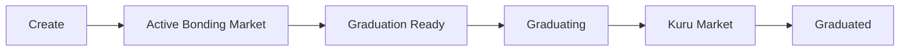
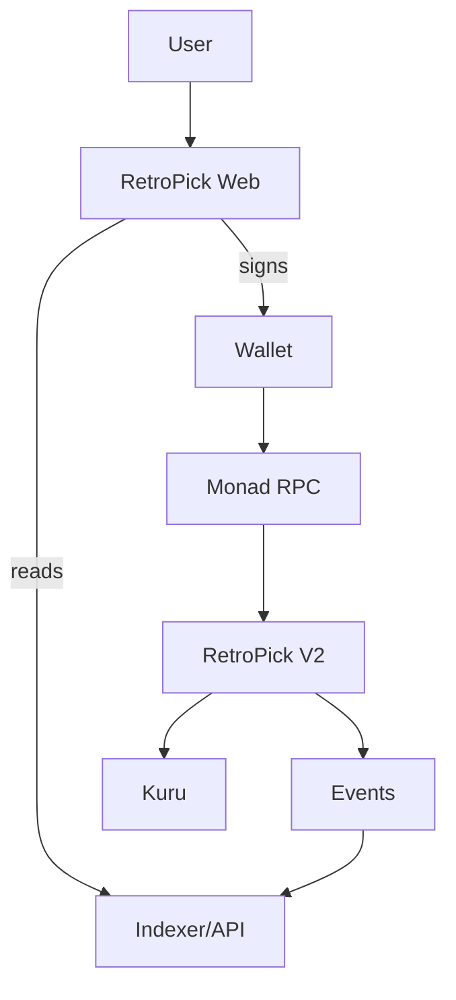

# Architecture Diagrams

**Status:** ACTIVE  
**Owner:** Architecture

## Launch lifecycle

## Read/write topology

## Authority

Contracts own economics. Kuru owns mature-market execution. Indexer/API own read optimization. Frontend owns user interaction.
