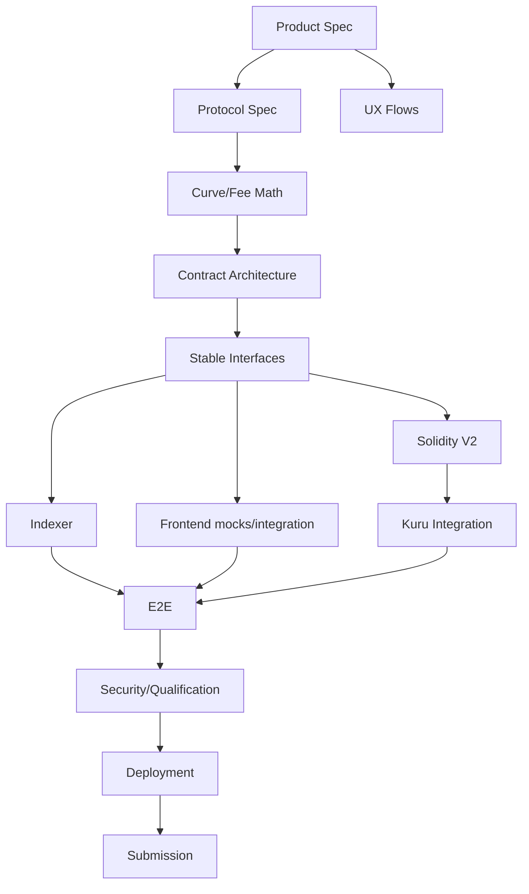

# Development Dependency DAG

```mermaid
flowchart TD
  P[Product Spec] --> S[Protocol Spec]
  S --> M[Curve/Fee Math]
  P --> U[UX Flows]
  M --> A[Contract Architecture]
  A --> I[Stable Interfaces]
  I --> C[Solidity V2]
  I --> D[Indexer]
  I --> F[Frontend mocks/integration]
  C --> K[Kuru Integration]
  D --> E[E2E]
  F --> E
  K --> E
  E --> Q[Security/Qualification]
  Q --> X[Deployment]
  X --> H[Submission]
```

Frontend and indexer may proceed in parallel after interfaces/events stabilize. Production claims wait for the complete downstream path.
