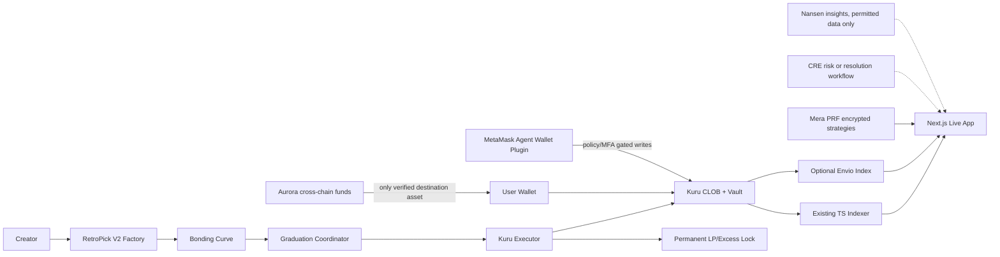

# RetroPick Metropolis — 72-hour Integration Master Plan
**Snapshot:** 2026-10-11 | **Deadline:** 2026-10-14 10:59 GMT+7 | **Track:** Onchain Finance & Trading | **Status:** planning, NOT implementation proof.
**Agent instruction:** Read `09-AGENTS-HANDOFF.md` and the bounty-specific file before coding. Existing deployed V2 must remain intact.

## Executive decision
**Primary narrative:** "RetroPick turns new assets into functioning Monad markets: transparent issuance and price discovery, then verified Kuru graduation, protected initial liquidity, and real orderbook execution." This is already demonstrated for generic creator tokens. A truly NEW asset class (event-backed outcome claims) would improve Kuru New Assets eligibility, but is a **new protocol project**, not a UI toggle. Do not claim the PRISM protocol is deployed.

**Recommended delivery order:** preserve current live V2 + submission evidence > Kuru Consumer UX > Envio event intelligence > Mera PRF Private Strategy Vault > MetaMask Agent Wallet plugin > Aurora live any-chain fund-and-trade > CRE > Nansen. User's explicit top-four priorities are Aurora, Kuru New Assets, Mera PRF and MetaMask. The engineering order differs because Aurora and a new outcome-token contract are dependency/high-risk gates. If one senior engineer has ~30–40 productive hours in the 72-hour calendar window, completing all eight is implausible. Parallel agents help only after a stable integration contract.

## Eight selected bounties: fit / incremental effort / go-no-go
| Sponsor | Prize and track | Current evidence | 72h fit (1–5) | Incremental effort (engineer-hours) | Decision |
|---|---|---|---:|---:|---|
| Kuru New Assets | $5k, Onchain Finance | Real Kuru market+orders; creator tokens NOT proved novel class | 2 | 24–40 for minimal outcome asset, 60+ for PRISM | P0 CONDITIONAL: novel claim prototype only after math/security gate |
| Aurora Intents | $5k pool ($2.5k first), all | No live cross-chain receipt shown | 2 | 12–24 plus access/funding | P0 user choice; 4h feasibility spike then go/no-go |
| Mera One Passkey Many Keys | $2.5k, all | PRF not implemented in live V2 | 4 | 8–14 | P0, isolated encrypted strategy vault |
| MetaMask Agent Wallet Plugin | $2.5k, Onchain Finance | Not implemented; existing Kuru ABI reusable | 3 | 12–20 plus CLI compatibility | P0, bounded launch-trading plugin |
| Kuru Consumer Trading App | $5k, Onchain Finance | Real frontend order/fill/cancel proof | 5 | 4–8 | HIGH ROI: select/retain if eligible |
| Envio | $1k, all | Existing custom TS indexer, no verified Envio integration | 4 | 8–16 | Add if real indexed core feature |
| Chainlink CRE | $3k, all | PRISM resolution only specified, not deployed | 2 | 8–18 | Graduation-risk workflow if no prediction resolver |
| Nansen | $5k pool ($2k first), all | No verified Nansen call | 2 | 5–10 plus key/licensing | Conditional; testnet assets may lack coverage |

**Prize arithmetic:** Eight listed bounty prize pools total $29,000, NOT $29,000 attainable by one team. Top advertised award amounts across these eight total at most $23,500 before eligibility, sponsor stacking, and competition. Primary track is $30,000 across three $10,000 winners. Never use pooled total as expected winnings.

## Canonical repo and evidence
- Repo: https://github.com/RetroPick/retropick-protocol (default branch main; verify HEAD before implementation).
- Live frontend: https://retropick-metropolis.vercel.app
- `README.md`, `HACKATHON.md`, `docs/hackathon/EVIDENCE_MAP.md`, `docs/hackathon/METROPOLIS_REQUIREMENTS.md`, `docs/hackathon/KURU_BOUNTY.md`.
- `contracts/src/v2/RetroPickLaunchFactoryV2.sol`, `RetroPickBondingCurveV2.sol`, `GraduationCoordinatorV2.sol`, `KuruGraduationExecutorV2.sol`, `KuruLiquidityLockV2.sol`.
- `apps/web/lib/live/client.ts`, `wallet.tsx`, `kuru.ts`, `model.ts`; `apps/web/features/live/kuru.tsx`; `apps/web/app/api/chain/route.ts`; `apps/indexer/src/project.ts`.
- `deployments/monad-testnet/v2.json` chainId 10143; factory `0xa7f18b9eceb0A9852b08408854A45D00fc682454`, coordinator `0xaD62309242EA65BB07C833669EC6a4ED23AF738F`, demo Kuru market `0x1F5dE72616a7fe645Cf45aC66dfce8Ac7452C57F`. Deployment source SHA `f0363249f4b74e58dde37d1241742ca5a92bcfe3` is NOT necessarily current main HEAD.
- Existing proofs: launch, buy, graduation, Kuru order/fill/cancel and browser E2E; functional testnet transactions, NOT organic traction. Canonical Circle-USDC live smoke BLOCKED_FUNDING; unaudited testnet only.
- Uploaded older Base Sepolia MarketEngine/Go/fe-v1 reference is NOT current deployment. `docs/prism/**` is ambitious SPEC/RESEARCH; `docs/prism/05-hackathon/MVP.md` explicitly excludes StatePool/SLE from MVP and does not establish deployment. Production Solidity gates are not passed merely by writing docs.

## As-is -> to-be (no change to V2 custody authority)

No sponsor adapter may gain custody of graduation collateral, impersonate user signing, override the coordinator's accounting, or mark a cross-chain transfer settled from a frontend callback.

## Critical 72-hour schedule (GMT+7)
**Oct 11 02:30–08:30 (0–6h):** freeze current repo SHA and release evidence; verify submission form; smoke live Kuru; check Aurora route source→Monad token and funds; Mera PRF support on TWO devices; MetaMask CLI/plugin version and Monad transaction; access keys for Envio/Nansen/CRE. Abort inaccessible integrations.
**Oct 11 08:30–Oct 12 02:30 (6–24h):** one agent preserves primary V2+Kuru consumer proof, one implements PRF vault, one scaffolds plugin; Aurora agent performs first REAL route if supported. Separate contract agent designs bounded outcome token only if full time/security staffing exists.
**Oct 12 02:30–Oct 13 02:30 (24–48h):** finish integration tests, Envio derived read-model, plugin install/write, Aurora arrival+in-app use; run Foundry regression and Next.js checks. CRE/Nansen only if P0 gates pass.
**Oct 13 02:30–Oct 14 02:30 (48–72h):** full judge E2E on fresh browser, reorg/replay/timeout/refund tests, videos, sponsor evidence, submission drafts, pitch. No protocol changes after Oct 13 18:00 unless fixing critical breakage.
**Oct 14 02:30–10:59:** protected submission buffer; upload early, verify all URLs/permissions, do not wait for last minute.

## Go/no-go gates
G1 existing Kuru demo remains functional; G2 external Aurora route and destination token supported with real small transfer (otherwise withdraw bounty claim); G3 PRF derives same key on fresh profile/second synced device AND ciphertext decrypts; G4 plugin actually installs and a policy-gated write succeeds (or remove bounty); G5 new-asset claim has exact collateral accounting, redemption, Kuru listing and fill (or submit only existing V2 without novelty claim); G6 every selected sponsor has proof and submission field answered accurately.

## Security and economic boundaries
- Graduation quote collateral and LP/excess custody are NOT general-purpose funding pools.
- For future binary claims: lock 1 collateral before minting 1 YES + 1 NO; permit inverse merge; immutable resolution specification; deterministic invalid/cancel policy; redeem only on verified resolution; check token decimals/rounding and solvency; segregate trading liquidity from redemption collateral.
- Kuru Router market creation does not ensure depth; record bid, ask, tick, spread, size, actual fill and fee. No fake/wash volume.
- PRISM Phase-1 long-only exact-backed basket `h=Gx`, `B_i >= S*x_i` is a **separate research/contract track**. Shared State Liquidity Engine and Payoff AMM are future R&D, not a 72h deliverable.
- Legal review is needed before permissionless real-money event markets; testnet does not establish legal eligibility.

## Required submission packet
One primary track; project logo, public source and license/AI disclosure, live Monad link and judge instructions, <=3min live technical demo, <=2min founder pitch, actual chain tx hashes, 30/60/90d plan, measurable (non-fabricated) demand. Sponsor-specific <=2min videos except MetaMask <=5min and Envio optional <=2min. Portal requirements and repo's older scoring/logo limits differ: recheck live authenticated portal. Deadline above is user-captured portal time.

## Sources
https://hackathon.monad.xyz/tracks/onchain-finance
https://docs.kuru.io/sdk/deploy-market
https://docs.metamask.io/agent-wallet/
https://github.com/MetaMask/agent-wallet-plugin-examples
https://docs.envio.dev/docs/HyperIndex/overview
https://docs.chain.link/cre
https://docs.nansen.ai/
https://docs.intents.aurora.dev/
https://mera.category.xyz/concepts/passkeys-and-prf/
