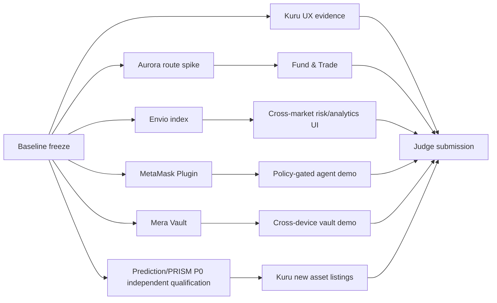

# Sponsor Integration Execution Protocol — agent playbook
**Target:** design once; enable eight sponsor-specific, feature-flagged integrations without regressions or simulated claims.

## Stage 0 — repository+environment census (30 min)
```bash
git status --short
git rev-parse HEAD
git worktree list
node -v
pnpm --version
pnpm --filter @retropick/web typecheck
pnpm --filter @retropick/indexer test
# Contracts follow contracts/README.md, include fresh fork qualification and strict runtime size checks.
```
Record immutable base SHA, current active package and deployment manifest. Note `apps/web/README.md` may describe an older fixture-only frontend; inspect deployed Next/Vinext entrypoints and `apps/web/package.json` before touching UX.

## Stage 1 — sponsor capability spike, hard timebox
0–4h each external dependency; fail closed if no supported chain/asset/auth/receipt. Produce `capability-check.json`:
```json
{
  "sponsor":"Aurora|Kuru|Mera|MetaMask|Envio|CRE|Nansen",
  "testedAtUtc":"REQUIRED",
  "repoSha":"REQUIRED",
  "officialSourceUrls":[],
  "packageOrCliVersion":"REQUIRED",
  "chainId":10143,
  "network":"testnet",
  "sdkCompatibility":"PASS|FAIL|UNKNOWN",
  "auth":"PASS|BLOCKED|NOT_REQUIRED",
  "liveCall":"PASS|BLOCKED|NOT_ATTEMPTED",
  "transactionEvidence":[],
  "blockers":[],
  "decision":"GO|DEFER|ABORT"
}
```
Mera: PRF on exact RP ID. MetaMask: `mm doctor`, install sample plugin without auto-trusting capabilities. Envio: generate/validate indexer with current CLI. Aurora: quote actual destination asset. CRE: simulate on testnet. Nansen: allowed endpoint+license, testnet coverage explicit. Kuru: read real market params and trade receipt.

## Stage 2 — shared adapters (proposed paths)
```
apps/web/lib/integrations/{aurora,mera,envio,nansen}/...
apps/web/features/{fund-and-trade,private-strategy,market-intelligence}/...
apps/web/app/api/integrations/{aurora,nansen}/route.ts [server-only, only if required]
integrations/{envio,cre,metamask-agent-wallet}/...
research/contract-kernels/src/hackathon/* [existing P0 research, no unreviewed rewrite]
evidence/hackathon/metropolis/sponsors/<sponsor>/{README.md,capability-check.json,checks.json}
```
No code exists solely because a path appears here. Each new module must have an owner, schema, package boundary and tests. Never turn `apps/web/app/api/chain/route.ts` into a signing/RPC-write proxy.

## Stage 3 — common protocol envelopes (proposed TypeScript design, not a deployed API)
```ts
type Money = { chainId: number; tokenAddress: `0x${string}` | 'native'; decimals: number; atomic: string };
type SponsorState = 'disabled'|'unavailable'|'quoting'|'awaiting_user'|'submitted'|'confirmed'|'reconciled'|'failed'|'expired'|'refunded';
type SourceReceipt = { chainId: number; txHash: `0x${string}`; blockNumber: string; logIndex?: number };
type RouteIntent = {
  id: string; provider: string; source: Money; destination: Money;
  recipient: `0x${string}`; minOutputAtomic: string; expiresAtUnix: number;
  sourceTxHash?: `0x${string}`; destinationTxHash?: `0x${string}`; state: SponsorState;
};
type ReadModelEnvelope<T> = { data: T; chainId: number; indexedBlock: string; indexedAt: string; source: 'envio'|'existing-indexer'|'direct-rpc'; finalized: boolean };
```
Serialize integers as strings across JSON boundaries and convert to BigInt only inside typed code. Never use JS float to settle or calculate max-spend. Maintain immutable quote/route ID and idempotency keys. Source tx confirmation ≠ destination settlement ≠ funds credited to Kuru margin ≠ filled trade.

## Stage 4 — transaction pipeline / invariants
```
input validate -> supported chain/asset -> locked quote/nonce -> balance & allowance -> preflight read -> simulate -> explicit confirmation / wallet policy -> broadcast -> receipt/finality -> indexed reconciliation -> verified UI status
```
Reorg: append immutable event ID `chainId:txHash:logIndex`; on block-hash mismatch replay derived state without double counting. Failed or timed-out cross-chain operation must provide retry/recovery/refund path, never silent completion. **Never allow cross-chain solver to transfer to an unverified/unowned Kuru margin address on user behalf.**

## Stage 5 — deterministic tests and dev ergonomics
- Contract P0 tests before deployments: split, merge, resolver cutoff, exact collateral, duplicate series, negative control, fee-on-transfer, reentrancy, insufficient backing, invalid outcome, bounded supply.
- Envio: use current generated handler, `createTestIndexer()` and `pnpm test`, reconcile every indexed row with real chain logs.
- MetaMask: plugin manifest permission approval, policy denial, pending MFA, order price/tick, duplicate retry, owner-only cancellation; sample `walletExecutor` access does not count as trade execution.
- Mera: vault encrypt/decrypt, ciphertext tampering, PRF unavailable, wrong RP ID, synced cross-device check; redact all secrets.
- Aurora: quote stale, exact token address mismatch, refund, receipt missing, partial fill, conversion to real V2 MON before trading.
- CRE: simulate success+failure (stale API, conflicting evidence); verify output cannot mutate V2 custody.
- Nansen: licensing-safe endpoint, attribution, rate limit and zero-data fallback.
- Browser: Playwright clean wallet path and Android viewport, pre/post tx, freshness banners, disabled write when market params mismatch.

## Stage 6 — judge-grade evidence
```yaml
status: VERIFIED_LIVE|VERIFIED_SIMULATION|BLOCKED|UNIMPLEMENTED
sponsor: ""
commit: ""
date_utc: ""
chain: 10143
sdk_version: ""
feature_flag: ""
exact_official_sources: []
commands_run: []
unit_tests: []
integration_tests: []
source_transactions: []
destination_transactions: []
contract_addresses: []
offchain_response_redacted: ""
reconciliation: ""
wallet_policy_or_prf_assertion: ""
video_url: ""
known_limitations: []
```
Require real explorer-linked source/destination transactions for Aurora, real Kuru order/fill/cancel for Kuru/MetaMask (where bounty requires), real GraphQL/indexed result for Envio, credential prompt+actual ciphertext decrypt for Mera, recorded CRE simulation for CRE, Nansen server response with legal display review. Synthetic fixture/demo paths must be visibly marked.

## PR DAG (can parallelize after common boundary frozen)

Independent agent worktrees/branches only; one integrator reviews integration interfaces, version lockfiles, frontend conflicts. Reviewer must approve every code-changing merge. Do not conflate sponsor proof with project release gates.

## Submission protection
Reserve **at least final 8 hours** for accessible demos, verified URLs, proof matrix, pitch, technical video and portal submissions; freeze new contract deployments earlier. Prune bounty selection if not evidenced. Main path must run on a fresh judge browser without relying on a founder-local auth session.
